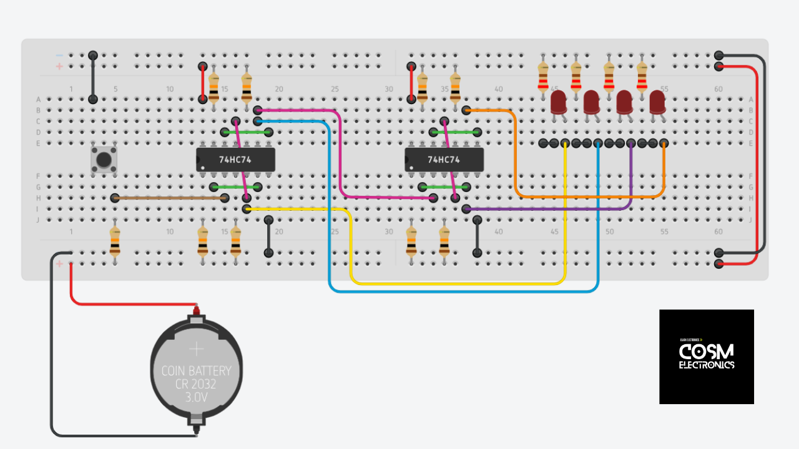

# 4-Bit Counter Using Two 74HC74 D Flip-Flop ICs (Pushbutton Clock with Pull-Ups)

This project implements a **4-bit binary ripple counter** on a breadboard using **two 74HC74 Dual D-Type Positive Edge-Triggered Flip-Flop ICs**.
The counter increments on each clock pulse from a pushbutton and displays the binary count on **four LEDs** (0000 → 1111).

---

## 📜 Table of Contents
- [Introduction](#introduction)
- [Components Required](#components-required)
- [7474 Pinout](#7474-pinout)
- [Breadboard Layout](#breadboard-layout)
- [YouTube Video Link](#youtube-video-link)
- [Connections](#connections)
- [Working Principle](#working-principle)
- [Testing](#testing)
- [Troubleshooting](#troubleshooting)
- [Example Output Table](#example-output-table)
- [Live Demo Link](#live-demo-link)

---

## Introduction

A 4-bit counter cycles through the binary sequence **0000 to 1111 (0–15 in decimal)** and repeats.
With two 74HC74 ICs (each having two D flip-flops), we can chain four flip-flops to make this counter.

This build uses:

* **Pull-up resistors (10 kΩ)** on control lines for stable operation.
* **Pushbutton clock input with pull-up** for manual counting.
* **LEDs on outputs** to visualize the 4-bit binary sequence.

---

## Components Required

| Component                  | Quantity  |
| -------------------------- | --------- |
| 74HC74 D Flip-Flop IC      | 2         |
| Breadboard                 | 1         |
| Jumper wires               | As needed |
| LEDs                       | 4         |
| Resistors (330 Ω)          | 4         |
| Pushbutton (momentary)     | 1         |
| Resistors (10 kΩ pull-ups) | 9         |
| 3V or 5V DC power source   | 1         |

---

## 7474 Pinout

```
      +---+--+---+  
 1CLR |1  +--+ 14| VCC  
   1D |2       13| 2CLR  
 1CLK |3       12| 2D  
 1PRE |4       11| 2CLK  
   1Q |5       10| 2PRE  
  1Q̄ |6        9| 2Q  
  GND |7        8| 2Q̄  
      +----------+  
```

---

## Breadboard Layout

**4-Bit Counter Breadboard**



---

## YouTube Video Link

[4-Bit Counter Breadboard Demonstration](#)

---

## Connections

**Power:**

* Pin14 → +V (3V or 5V depending on IC version)
* Pin7 → GND

**Control Inputs (pull-ups):**

* Pins 1, 4, 10, 13 (on both ICs) → +V via 10 kΩ resistors

**Flip-Flop Wiring:**

* U1-FF1: Pin2 (1D) ← Pin6 (1Q̄)
* U1-FF2: Pin12 (2D) ← Pin8 (2Q̄)
* U2-FF1: Pin2 (1D) ← Pin6 (1Q̄)
* U2-FF2: Pin12 (2D) ← Pin8 (2Q̄)

**Clock Inputs:**

* U1-FF1 Pin3 (1CLK) → Pushbutton → GND
* Add 10 kΩ resistor from Pin3 to +V (pull-up)
* U1-FF2 Pin11 (2CLK) ← U1-FF1 Q (Pin5)
* U2-FF1 Pin3 (1CLK) ← U1-FF2 Q (Pin9)
* U2-FF2 Pin11 (2CLK) ← U2-FF1 Q (Pin5)

**LED Outputs:**

* U1-FF1 Pin5 (Q0) → 330 Ω → LED (LSB) → GND
* U1-FF2 Pin9 (Q1) → 330 Ω → LED → GND
* U2-FF1 Pin5 (Q2) → 330 Ω → LED → GND
* U2-FF2 Pin9 (Q3, MSB) → 330 Ω → LED → GND

---

## Working Principle

* **FF0 (LSB)** toggles on every rising edge from pushbutton clock.
* **FF1** toggles on every second pulse.
* **FF2** toggles on every fourth pulse.
* **FF3 (MSB)** toggles on every eighth pulse.

Thus, the LEDs display the 4-bit binary count:

```
Q3 Q2 Q1 Q0
0  0  0  0
0  0  0  1
0  0  1  0
...
1  1  1  1
```

(repeats)

---

## Testing

1. Power the circuit.
2. Press the pushbutton to increment the count.
3. Observe:

   * Q0 toggles every press.
   * Q1 toggles every 2 presses.
   * Q2 toggles every 4 presses.
   * Q3 toggles every 8 presses.

---

## Troubleshooting

* **No LED change:** Ensure PRE and CLR are pulled HIGH (inactive).
* **Random toggles:** Add 0.1 µF capacitor across pushbutton (debounce).
* **Always ON/OFF LEDs:** Check Q → D and clock wiring.

---

## Example Output Table

| Press Count | Q3 LED | Q2 LED | Q1 LED | Q0 LED |
| ----------- | ------ | ------ | ------ | ------ |
| 0           | OFF    | OFF    | OFF    | OFF    |
| 1           | OFF    | OFF    | OFF    | ON     |
| 2           | OFF    | OFF    | ON     | OFF    |
| 3           | OFF    | OFF    | ON     | ON     |
| 4           | OFF    | ON     | OFF    | OFF    |
| …           | …      | …      | …      | …      |
| 15          | ON     | ON     | ON     | ON     |
| 16          | OFF    | OFF    | OFF    | OFF    |

---

## Live Demo Link

[4-Bit Counter Breadboard Demonstration](https://www.tinkercad.com/things/0uZp85dLDtB-4-bit-counter-using-74hc74-d-flip-flop)

---

**Author: Prince Kumar Kushwaha – CEO of COSM Electronics**

